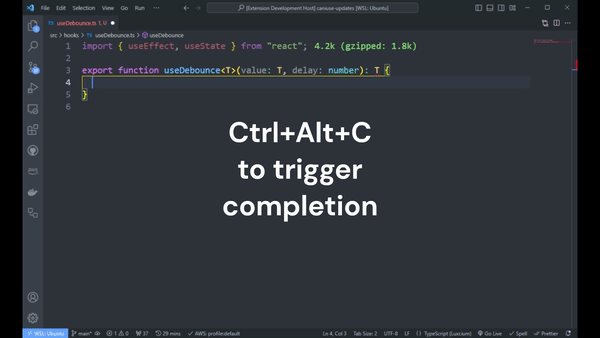

# local-ai-code-completion README

Enables AI Assisted code completion, similar to Github Copilot, completely locally. No code leaves your machine. This has two major benefits:

- **Cost**. This extension is completely free to use.
- **Privacy**. No data is shared with third-parties, everything stays on your computer.

## Features

AI Assisted code completion.

You trigger code completion by pressing <kbd>Ctrl</kbd>+<kbd>Alt</kbd>+<kbd>C</kbd>.

You accept a completion by pressing <kbd>Tab</kbd>.

You cancel an ongoing completion by pressing <kbd>Escape</kbd>.

You delete a non-accepted completion by pressing <kbd>Escape</kbd>.

GIF is sped up.

The extension uses codellama 7B under the hood, which supports many languages including Python, C++, Java, PHP, Typescript (Javascript), C# and Bash.

According to evaluation results from Meta, codellama 7B is almost on par with Codex, the model used by Github Copilot.

## Requirements

This extension requires an [Ollama](https://ollama.ai/) installation to run the language model locally. Ollama does not currently support Windows, which also means that this extension is not compatible with Windows.

<!-- ## Extension Settings

Include if your extension adds any VS Code settings through the `contributes.configuration` extension point.

For example:

This extension contributes the following settings:

- `myExtension.enable`: Enable/disable this extension.
- `myExtension.thing`: Set to `blah` to do something. -->

## Known Issues

- Time to start generating can be very long. This is an inherent issue to the model running locally on your computer.
- Inference is slow. Also a consequence of running the model locally, but depends on your system.

## Release Notes

### 1.1.0

Added options for changing model, temperature and top_p parameters.

---

### 1.0.0

Initial release.

---
